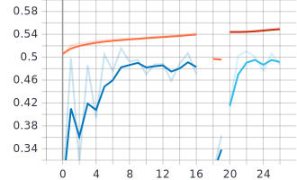

---
header-includes:
  - \usepackage{graphicx}
  - \hypersetup{colorlinks=false,
            allbordercolors={0 0 0},
            pdfborderstyle={/S/U/W 1}}
---
# TraderNet

TraderNet was created as a final project for CS6350 - big data. It
attempts to predict future stock prices either through classification
or regression. It incorporates distributed computing technologies like Spark to
preprocess a large number of historical stock price / volume records
into training examples that are then fed to a deep neural network
architecture implemented in Tensorflow. The aim of the network is to
aid in prioritizing technical analysis of stocks and serve as a basis
for future reinforcement learning models that will suggest trades
automatically.

## Preprocessing

### Dataset

The input dataset (taken from
[this](https://www.kaggle.com/qks1lver/amex-nyse-nasdaq-stock-histories)
Kaggle challenge) consists of approximately $8000$ CSV files, each of which
contains historical price records for a stock symbol from 1970
to 2018. Each record consists of the following columns:

```
date, high, low, open, close, volume, adjclose
```

The high, low, open, and close prices are historical prices as
recorded by the market on that day. The `adjclose` column provides an
adjusted close price that accounts for events like splits, which
retroactively affect historical price data. For example, if a company doubles its number of existing shares, the
price per share will be reduced by half. The adjusted close price
accounts for these changes, providing a shared scale on which to
measure closing price over the history of the stock.

### Filtering

Several filtering techniques can be applied to the input dataset in
order to produce higher quality training examples. One such technique
is the removal records older than a parameterized year.
Since the dataset contains records dating back to 1970, the
ability to constrain to more recent records may prove useful in
capturing market behavior under modern trading styles.

Another filtering technique is to remove penny stocks, which tend to exhibit greater
volatility due to their low price per share. This is accomplished
through the use of a parameterized closing price threshold. If the
average closing price of a stock over the constrained date window is
below the parameterized threshold, that stock will be excluded
entirely from the training example set.

### Positional Encoding

A positional encoding strategy was used to pass date information from
each record to the neural network in a numerically stable form. The underlying assumption
is that stocks may behave differently at different times of year (e.g.
during quarterly earnings reports, end of year, etc.), and thus this
information could prove useful to the network. The following function
was used to calculate a positional encoding based on the day of year:

$$
f(x) = \sin\left(\frac{\pi x}{365}\right)
$$

This function transforms a day of year on the interval $[1, 365]$ into a real number on a
continuous interval from $(0, 1]$. Under this transformation, day
$365$ and day $1$ will have similar values, capturing the idea that
December 31st and January 1st are close to each other. It is worth
noting that each point under this transformation will be produced by
two points in the original "day of year" space. This is not ideal, but
the network should be able to compensate based on whether or not the
point lies on an increasing or decreasing region in the encoded space.

### Price Adjustment

The close and adjusted close price given in the original dataset were used to
rescale the other original price metrics (high, low, open). This was
accomplished by apply the following transformation to each unscaled
price in the record:

$$
\text{scaled} = \text{unscaled} \cdot
\frac{\text{adjclose}}{\text{close}}
$$

After this point the unscaled prices were discarded. This places all
prices on a shared scale that is invariant to stock splits and other
price-altering events, improving continuity.

### Future Price Calculation

A future percent change in closing price was calculated for each
record by looking $x$ days into the future and calculating a pointwise
or aggregate measure of closing price over those $x$ days. One such
strategy is to calculate a pointwise percent change in
price as follows, where $i$ indicates an index of the record to be
labeled:

$$
\Delta = \frac{P_{i+x} - P_{i}}{P_i} * 100
$$

Another strategy is to calculate an aggregate of some price metric
over $x$ days in the future and calculate percent change from the present
price to that aggregate price. For example, one could calculate an average closing
price over the following $x$ days and then calculate percent change
in closing price from the present to that average.

$$
\begin{aligned}
	&\Delta = \frac{a - P_{i}}{P_i} * 100
	&\text{where}&
	&a = \frac{1}{x}\sum_{j=i+1}^{i+x} P_j
\end{aligned}
$$

The decision to use a pointwise or aggregate basis for percent change
calculation is dependent on the choice of window size among other
things. The choice of window size is primarily determined by the style
of trading to be used, along with the interval between records (if
this approach were to be applied to by the minute data for day
trading). For experimentation, percent change in future price was
calculated relative to the average closing price over a future $3$ day
window.

### Spark ML Pipeline

A parameterized Spark ML pipeline is used to extract feature vectors and produce
discretized labels for each record. The pipeline consists of the
following stages:

1. `VectorAssembler` - Collects feature columns into a single vector
	for processing

2. Normalizer - A strategy to normalize each feature to a shared
	domain. Can be one of the following, or excluded entirely:
	* `StandardScaler` - Rescales each feature to zero mean unit variance
	* `MaxAbsScaler` - Rescales each feature to the range $[0, 1]$,
		**preserving sparsity**

3. Labeler - A strategy to assign examples a discretized label based
	 on future percent change. Can be one of the following, or excluded entirely:
	* `Bucketizer` - Label based on fixed sized buckets of percent
		change
	* `QuantileDiscretizer` - Label based on variable sized buckets such
		that each each class contains an equal number of examples

The each record in the output of this pipeline will have a vector of
(normalized) features for that day, a future percent change value, and
an integer label if requested. By retaining both the future percent
change and a discretized label, each record is suitable for use with
classification or regression networks.

It is important to consider the distribution of examples among the
possible classes when using `Bucketizer` as a labeling strategy.
It was observed that percent change tends to concentrate near zero,
meaning that the bucket that overlaps with zero will have a
potentially large number of examples. This is likely to become more of
an issue with larger future window sizes, as price will have more time
to regress to the mean.

Conversely, when using
`QuantileDiscretizer` a uniform distribution of examples over each
class will be created by compressing or expanding bucket ranges such
that the $n$'th bucket contains the top $1/n$'th percent change values.
This will manifest as buckets that span only a few percentage points of
percent change, taxing the network's ability to distinguish these
classes. However, it does
eliminate concerns that the network will exhibit a bias towards zero
price movement predictions.

During experimentation the `MaxAbsScaler` was used as a normalization
strategy and the `Bucketizer` was used for a labeling strategy with
a bucket parameter list of $-5,-2,2,5$. This produced five discretized
classes in the resultant training set. Unequal bucket widths
were important in creating a somewhat balanced distribution of
examples among the labels while not forcing the network to learn
unreasonably small differences between the classes.


## Creating Training Examples

Having extracted numerically stable features and labels from the
original dataset, steps must now be taken to construct complete training
examples. Taking inspiration from human styles of trading, the
decision was made to create training examples by aggregating
chronologically ordered feature vectors over a sliding historical window into a
feature matrix.

As a concrete example, consider training example $i$ with features
$h,l,o,c,v,p$ and a window size of $x$. Example $i$ would then consist
of features over the $x$ previous days for that stock as follows:

$$
\text{example}_i = \begin{bmatrix}
	h_i & l_i & o_i & c_i & v_i & p_i \\
	h_{i-1} & l_{i-1} & o_{i-1} & c_{i-1} & v_{i-1} & p_{i-1} \\
	h_{i-2} & l_{i-2} & o_{i-2} & c_{i-2} & v_{i-2} & p_{i-2} \\
	\vdots & \vdots & \vdots & \vdots & \vdots & \vdots \\
	h_{i-x} & l_{i-x} & o_{i-x} & c_{i-x} & v_{i-x} & p_{i-x} \\
\end{bmatrix}
$$

The result of this process is an intuitively constructed training
example, consisting of an ordered time series of features over the $x$
previous days and a label indicating price movement in the near
future. Implementation of this process is discussed in the following
section.

We can take further steps to improve the quality of the resultant
training examples. Consider the case where the process described above
is applied to two adjacent records, $i$ and $i+1$. The result will be
two training examples with $x \times 6$ feature matrices which have a
substantial overlap. Specifically, we will produce feature matrices as
follows:

$$
\begin{aligned}
	features_i \in \mathbb{R}^{x \times 6} &=
	\begin{bmatrix}
		h_i & l_i & o_i & c_i & v_i & p_i \\
		\vdots & \vdots & \vdots & \vdots & \vdots & \vdots \\
		h_{i-x} & l_{i-x} & o_{i-x} & c_{i-x} & v_{i-x} & p_{i-x} \\
	\end{bmatrix}
	\\
	features_{i+1} \in \mathbb{R}^{x \times 6} &=
	\begin{bmatrix}
		h_{i+1} & l_{i+1} & o_{i+1} & c_{i+1} & v_{i+1} & p_{i+1} \\
		\vdots & \vdots & \vdots & \vdots & \vdots & \vdots \\
		h_{i-x+1} & l_{i-x+1} & o_{i-x+1} & c_{i-x+1} & v_{i-x+1} & p_{i-x+1} \\
	\end{bmatrix}
\end{aligned}
$$

Applying a stride greater than $1$ to the historical window will
reduce the amount of overlap between feature matrices, creating a
more diverse training set. For experimentation a stride of $5$ days
was chosen. This resulted in an adequate number of training examples
and minimized the overlap in the $3$ day future percent change
window.

Generating the feature matrices as described above is a
computationally expensive process, especially at small window
strides and large window sizes. To put this in perspective, consider a
training set produced from $1000$ stock symbols from $2008$ to $2018$
with a window size of $128$ days and a window stride of $1$. Assume
the stock only trades $200$ days out of the year.  The
number of resultant examples is given by

$$
\begin{aligned}
	N &= 1000 * 200 * (2018 - 2008) \\
	&= 2,000,000
\end{aligned}
$$

Similarly, if we consider this process applied the entirety of the
dataset without constraint

$$
\begin{aligned}
	N &= 8000 * 200 * (2018 - 1971) \\
	&= 75,200,000
\end{aligned}
$$

We will have a $128 \times 6$ feature matrix per row.
If we assume that each feature and the percent change is stored as a
$32$ bit float and the label is stored as an $8$ bit integer, we can
calculated the expected size of the resultant training set in

$$
\begin{aligned}
	features &= N \left(128 * 6 * 4\right) \\
	labels &= N \left(4 + 1\right) \\
	S &= labels + features \\
	&\approx 230 GB
\end{aligned}
$$

## Interfacing with Tensorflow

The above illustrates the need for careful consideration on how
Tensorflow should interface with Spark in order to handle the data
volume. Several strategies were considered:

### ~~Connect Tensorflow's computational graph to Spark~~
Some libraries do exist which promise to connect Tensorflow and Spark at
the graph level, allowing for training of a Tensorflow model in
Spark. This approach was ultimately not used, as it would require
sacrificing many of Tensorflow's high level features and presented
compatibility issues with Tensorflow 2.0. It would however avoid the
need to write the entire training set to disk prior to training and
would expedite the process of iteratively refining preprocessing
techniques based on model performance.

### Write training examples to TFRecords
Tensorflow uses `TFRecords` as a format for storing training examples in a
serialized form. A dataset can be split in to multiple TFRecord
files, enabling distributed training. Through the use of [spark-tensorflow-connector](https://github.com/tensorflow/ecosystem/tree/master/spark/spark-tensorflow-connector)
it is possible to generate TFRecords from a Spark dataframe, where the
number of TFRecord files is determined by the partitioning of the
dataframe. Initial efforts aimed to partition the records by stock
symbol, order them by date, and write each partition to a separate
TFRecord file. Under this strategy, Tensorflow would be responsible
for constructing training examples using the feature matrix generation
procedure described earlier.

By allowing Tensorflow to handle feature generation the size of the
TFRecord dataset will be reduced by a factor of the historical window
size. Unfortunately, this technique has the following requirements:

1. Strict partitioning by symbol to separate TFRecord files
2. Strict ordering by record date within TFRecord files
3. A complicated process to interleave examples from each file

According to
[this](https://github.com/tensorflow/ecosystem/issues/119) issue,
spark-tensorflow-connector does not currently respect the requested
partitioning by column, making requirement 1 unsatisfiable. This
necessitated the use of spark for feature matrix generation.

The training examples written to TFRecords by spark are complete
examples, containing a feature matrix, percent change value, and
discretized label (if requested). Tensorflow is able to deserialize
these examples with little additional processing.

The following steps are performed in Tensorflow to finalize the
dataset for training:

1. Create `(feature, label)` tuples for each example where the label
	 is chosen based on the current mode (regression or classification)
2. Split the dataset into training and validation sets based on a
	 parameterized validation set size.
3. Batch training and validation sets into a parameterized batch size.
	 A batch size of $128$ or $256$ was used in an effort to improve tiling
	 efficiency when training on a GPU
4. Final modifications like `repeat()` and `prefetch()`


## Model

TraderNet is based on a dominant object detection network I
have been implementing
[here](https://github.com/TidalPaladin/tiny-imagenet-demo). TraderNet
reduces the original 2D convolutional encoder to a 1D residual
encoder, with the addition of a multi-head attention layer at the head
to better distinguish features based on their sequential relationship.

### Model Architecture

A summary of the model generated by Tensorflow is shown below. By
default there are four levels of downsampling with $3, 3, 5, 3$
bottleneck block repeats respectively. During experimentation, it was
found that a $4, 6, 10, 4$ level repeat structure was more robust, and
is shown below:

```
Model: "trader_net" - modified from model.summary()
_________________________________________________________________
Layer (type)                 Output Shape              Param #
=================================================================
tail (Tail)                  (None, 128, 32)           672
_________________________________________________________________
4x bottleneck (Bottleneck)      (None, 128, 32)        696
_________________________________________________________________
downsample (Downsample)      (None, 64, 64)            8048
_________________________________________________________________
6x bottleneck (Bottleneck)   (None, 64, 64)            2416
_________________________________________________________________
downsample_1 (Downsample)    (None, 32, 128)           31456
_________________________________________________________________
10x bottleneck (Bottleneck)   (None, 32, 128)          8928
_________________________________________________________________
downsample_2 (Downsample)    (None, 16, 256)           124352
_________________________________________________________________
4x bottleneck (Bottleneck)   (None, 16, 256)           34240
_________________________________________________________________
downsample_3 (Downsample)    (None, 8, 512)            494464
_________________________________________________________________
attn (MultiHeadAttention)    (None, None, 512)         1051649
_________________________________________________________________
head (ClassificationHead)    (None, 5)                 2565
=================================================================
Total params: 1,932,726
Trainable params: 1,922,902
Non-trainable params: 9,824
_________________________________________________________________
```

### Loss / Metrics

When operating in classification mode, the model uses a sparse softmax
cross-entropy loss. Sparse categorical accuracy is continuously
tracked for the training set and is reported once per epoch for the
validation set. Depending on the number of discretized classes it may
be helpful to add a top k categorical accuracy in the case of closely
related classes.

In regression mode the model uses mean squared error as a loss
function and is tracked with the same frequency as the classification
pipeline. While regression functionality was retained in the network
implementation, regression was not ultimately used for final
experimentation.

### Hyperparameters

Key tunable hyperparameters include the following:

1. **Dropout** - A dropout layer can be added after the attention
	 layer to make the model more robust. This layer was excluded from
	 the final project submission, as it would be impractical to train
	 the model to convergence in the time alloted to complete the
	 assignment.

2. **Batch size** - Tune this as needed for your hardware. It is
	 probably wise to use a power of two batch size in order to improve
	 tiling efficiency for matrix matrix multiplication.
	 A batch size of $256$ was typically used for experiments.

3. **Learning rate** - Learning rate can be tuned directly, with
	 values around $0.001$ tending to work well. A learning rate greater
	 than $0.1$ often hindered the training process, likely due to the
	 lack of a robust weight initialization strategy. Learning rate is
	 reduced in a stepwise manner using a parameterized Tensorflow
	 callback based on the change in loss between epochs.

4. **Regularization** - Some experiments were conducted with
	 regularization of the dense layers at the network head, but there
	 appeared to be no discernible impact on model performance. This may
	 be more significant when training on a small subset of the original
	 dataset, such as a single stock or a narrow range of dates. Given
	 the size of the training set, the use of regularization as a method
	 of combating overfitting is likely unwarranted.

### Monitoring

Tensorboard callbacks are used to provide an interface for monitoring
the training process and hyperparameter tuning. Use of Tensorboard is
discussed in the usage section below. Model weights are checkpointed
once per epoch and can be restored when entering a new training session.


## Usage

There are two separate usage procedures, one for the Scala JAR file
that handles TFRecord production, and one for the Python Tensorflow
training pipeline.

### Spark

The [spark](./spark) directory contains a `sbt` project that can be
used to package a fat JAR file. The fat JAR file contains all
dependencies (like spark-tensorflow-connector) but can become large.
Build the fat JAR locally using `sbt assembly`.

The program provides usage instructions via the `--help` flag as follows:

```
trader 1.0
Usage: trader [options] <shell_glob>

  -o, --out <path>         output file path
  -n, --norm std, maxabs   Normalization with StandardScaler or MaxAbsScaler
  -d, --date <year>        limit to records newer than <year>
  -p, --past <int>         aggregate past <int> records into an example
  --stride <int>           stride training example window by <int> days
  -f, --future <int>       calculate percent change over <int> following days.
													 if >1, use averaging
  --max-change <float>     drop examples with absolute percent change > <float>
  -s, --shards <int>       split the TFRecord set into <int> shards
  --quantize <int>         run QuantileDiscretizer to <int> buckets
  --bucketize <float>,[float,...]
                           run Bucketizer with the given buckets
  --penny-stocks           if set, allow penny stocks. default false
  --help                   prints this usage text
Note: TFRecords will be written if output file path is specified

Writing many TFRecords has a high RAM requirement.

  <shell_glob>             input file shell glob pattern
```

If you run the program without specifying an output file path, no
TFRecords will be produced, but dataframes will still be printed that
describe the processed output. **Note* that the process of creating
TFRecords can have significant CPU, memory, and disk requirements
depending on the combination of flags given. The configuration used
for experimentation
would require approximately 40GB of memory and the resultant TFRecords
would occupy 10G of disk space.

The `<shell_glob>` argument should be path or wildcard containing path
(e.g. `path/to/dir/*.csv`). This string will be fed directly to Spark's
`DataFrameReader.csv()`.

**For simple testing** the most effective strategy is to choose a
shell glob pattern that will select only a small number of CSV files,
e.g. `AAPL.csv` or `AAP*.csv`. Please see the [output](./output)
directory for sample commands and output. It may be necessary to wrap
your glob pattern as a string literal (e.g. `'*.csv'`) to prevent
shell expansion to multiple filename arguments.

### Tensorflow

TraderNet is packaged as a Docker container to effectively manage
dependencies on Tensorflow 2.0 and Tensorboard. A docker-compose file
is provided to simplify the build process, and allows for selection of
the Tensorflow base image tag (GPU or no GPU). Edit the docker-compose
`upstream` build arg to pick the desired Tensorflow container tag. You can
download Tensorflow 2.0 and run the model outside of Docker if
desired.

A `.env` file is provided that sets environment variables needed
when starting the container with docker-compose. These variables
include paths to the TFRecord source directory and log / checkpoint
output directory:

```
SRC_DIR=/path/to/tfrecords
ARTIFACT_DIR=/path/to/logs
```

Set these variables as desired or override them directly in the
docker-compose file. When starting the container with docker-compose,
these directories will be mounted as container volumes. The paths
given to local directories must be absolute paths in order for Docker
to mount the path as a volume.

Next, start the container with

```
docker-compose up -d trader
```

You should be able to visit `localhost:6006` to access Tensorboard.
Once the container is running, start the training pipeline using

```
docker exec -it trader python /app/train.py
```

For example,

```
docker exec -it trader python /app/train.py --classes 5 \
	--levels 4,6,10,4 --speedrun
```

The `train.py` script accepts several command line flags that
parameterize the training process and can be accessed using the
`--helpfull` flag.

```
docker exec -it trader python /app/train.py --helpfull
```

Notable flags include:

1. `--classes` - **Must** be set to the number of labels in the
	 TFRecord dataset

2. `--summary` - Prints the network summary and exits

3. `--src, --dest` - Defaults to Docker volume mounts from docker
	 compose

4. `--mode` - Toggle from default `classification` mode to
	 `regression` mode

5. `--speedrun` - Runs a quick demo to show that the pipeline is
	 operating correctly. Runs through very small epochs, printing model
	 output for a small number of training examples.  This can be useful
	 when combined with the `--resume` flag to evaluate a trained model
	 given a saved model weights file.

6. `--artifacts_dir` - Directory where Tensorboard logs, model
	 checkpoints, etc will be written. Defaults to a Docker volume

7. `--resume` - Filepath for a model weights file. The model will be
	 initialized with these weights and will resume training.

8. `--resume_last` - Attempts to automatically detect the last model
	 checkpoint file and resume training from the checkpointed weights.


## Results / Conclusions

The model's classification performance was ultimately benchmarked using both
categorical accuracy and top $2$ categorical accuracy. Due to the
model's complexity, training to convergence was impractical in the
timeframe alloted for the assignment, but the model still performed
reasonably well. The plots below show sparse categorical and top k
accuracy for several (interrupted) runs. Validation top $1$ categorical
accuracy reached as high as $51\%$, while top 2 categorical accuracy
reached $74\%$. The model took between five and ten minutes per epoch depending
on choice of batch size, which each epoch containing on average
$400,000$ training examples. Note that this training set was a
fraction of the potential number of training examples that could be
generated from the original dataset. By relaxing price and date
constraints it is possible to generate a much larger number of
examples if one has the resources to train on such a sample size.

The graphs below were extracted from Tensorboard. Note that the broken
lines in the plot below are the result of interrupted training sessions
that were resumed using model checkpoints. Further work is needed to
produce a clean and continuous plot of network performance as time
becomes available.





Though the accuracy reached by the model in the available training
window is acceptable given the difficulty that humans have in
predicting stock movement, this model would likely perform much better
given more training time. Given that the number of potential
training examples nears that of ImageNet (which may take month to
train with state of the art models), I suspect that the few hours
of training alloted to this model across various hyperparameter
tuning runs was insufficient to demonstrate the model's full
potential.

A `.hdf5` file containing the trained model weights is provided
in the root directory and can be used with the `--resume` and
`--speedrun` flags to perform a rough evaluation as follows:

Copy the model weights file into the running Docker container. It is
important that the weights file be of the form `name_epoch.hdf5`, as
the epoch will be read from the filename when resuming.

```
docker cp trader_27.hdf5 trader:/
```

Then conduct a speedrun using the saved model weights. The level
parameterization must match what is given below in order for the
weights to load correctly.

```
docker exec -it trader python /app/train.py \
	--dry --classes 5 --levels 4,6,10,4 \
	--resume=/trader_27.hdf5 --speedrun
```

## Future Work

There are several areas where the preprocessing and training pipeline
can be improved. These include:

1. Adding steps to produce metrics like exponential moving average and
	 add them to the
	 Spark pipeline. This may allow the model to train faster by not
	 forcing it to learn a similar metric on its own.

2. Using Spark to enforce an equal distribution of examples over fixed
	 bucket sizes. While the `QuantileDiscretizer` does produce an equal
	 number of labels per class, the bucket sizes become unacceptably
	 close near zero percent change. The most promising resolution to
	 unequal class distributions is to apply `Bucketizer` over fixed
	 buckets and drop examples from highly represented classes.

3. Implementing metrics that are more indicative of the model's
	 performance. While categorical and top k categorical accuracy can
	 provide some idea of the model's theoretical performance, these
	 metrics are proxies for the most relevant metric: profitability.
	 The model's performance in a real trading environment will be
	 determined primarily by how well high-confidence predictions match
	 future trends, as these predictions will form the basis for trading
	 decisions. Future work could incorporate this model
	 into a reinforcement learning architecture, where network
	 performance can be directly assessed based on its profitability.

4. Expanding the one dimensional convolution input to two dimensions
	 by including the top $n$ correlated stocks over each training
	 example window. This would allow the network to condition its
	 output on the price trends of correlated
	 stocks in addition to the stock that has been targeted for
	 prediction.

4. Conduct automated experiments on the best choice of network
	 architecture in terms of repeat count for each convolutional encoder
	 layer. The selection of layer repeats used for experimentation was
	 inspired by Resnet-50, but other parameterizations may lead to
	 improved performance.

## References

* [This article on optimizer tuning](https://medium.com/octavian-ai/which-optimizer-and-learning-rate-should-i-use-for-deep-learning-5acb418f9b2)
* [Tensorflow's neural machine translation
	demo](https://www.tensorflow.org/beta/tutorials/text/nmt_with_attention),
	which inspired the multi-head attention layer implementation.

* [Attention is all you need](https://arxiv.org/abs/1706.03762)

* [Deep Residual Learning for Image
	Recognition](https://arxiv.org/abs/1512.03385), which inspired the
	convolutional encoder design.
